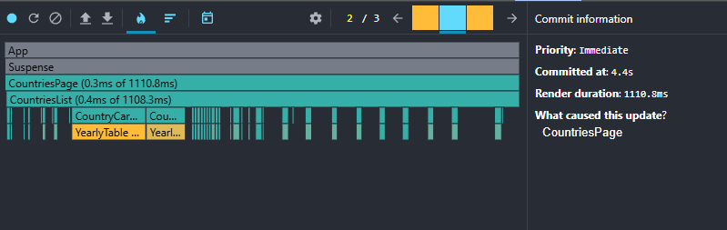
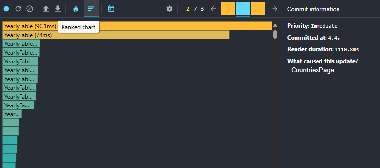
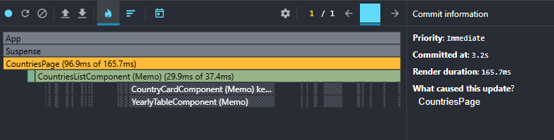
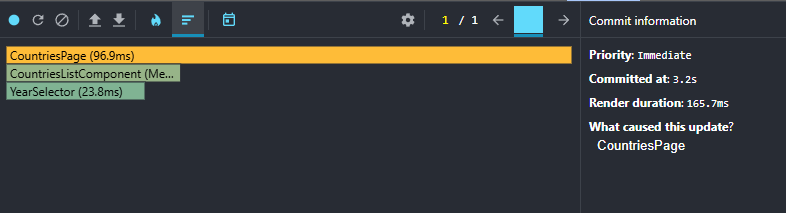
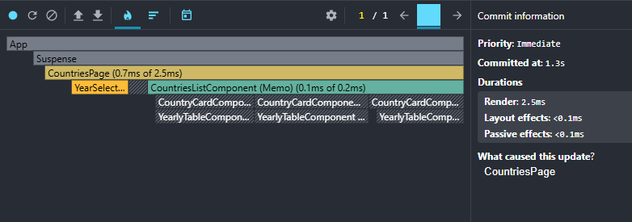
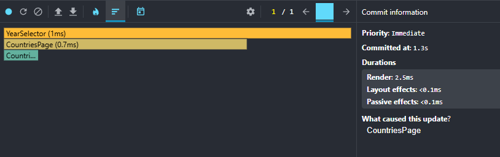
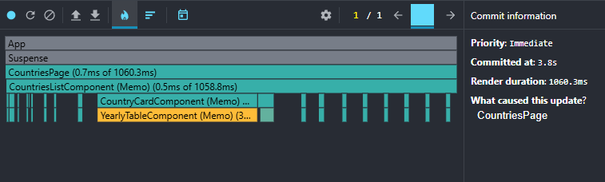
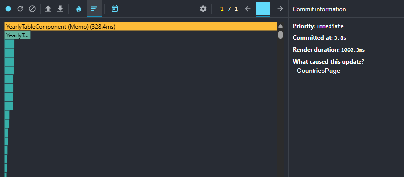
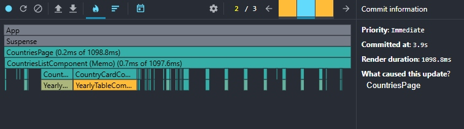
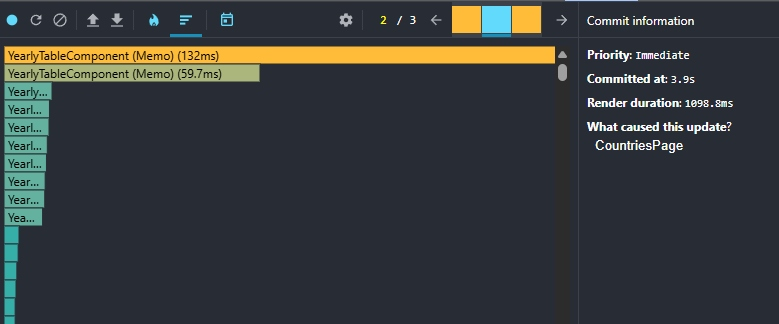

# React. Task #8 React Performance

## React Performance Profiling Report

## Baseline Performance (Before Optimizations)

### Test Scenarios

### 1. Sorting Performance

**Action:** Change sorting from "Name A-Z" to "Population descending"

**Metrics:**

- **Commit Duration:** 4.3 seconds
- **Render Duration:** 1415.7 milliseconds
- **Components Rendered:** ~240 components

**Interaction Details:**

- **Triggered by:** onChange (sort dropdown)
- **Total interaction time:** 4.3 seconds
- **Root cause:** CountriesPage state change

**Ranked Chart (Top 3 slowest):**

1. YearlyTable: 297.7 milliseconds (multiple instances)
2. CountriesPage: 285.2 milliseconds
3. CountryCard: ~50-100 milliseconds (multiple instances)

**Flame Graph:** [Screenshot attached]

**Analysis:** Every sort change triggers re-render of all country cards and data tables. YearlyTable components are the main performance bottleneck.

### 2. Search Performance

**Action:** Search for "United"

**Metrics:**

- **Commit Duration:** 1.6 seconds
- **Render Duration:** 12.8 milliseconds (vs 1415.7 milliseconds for sorting)
- **Components Rendered:** 3 countries found

**Interaction Details:**

- **Triggered by:** onChange (search input)
- **Total interaction time:** 1.6 seconds
- **Root cause:** CountriesPage state change

**Ranked Chart (Top 4 slowest):**

1. CountriesPage: 3.7 milliseconds
2. YearlyTable: 2.1 milliseconds
3. YearlyTable: 1.9 milliseconds
4. YearlyTable: 1.7 milliseconds

**Flame Graph:** [Both screenshots attached]

**Analysis:** Search is dramatically faster than sorting (12.8 milliseconds vs 1415.7 milliseconds render time) because filtering reduces the number of components. Only ~3 countries match "United", so only 3 YearlyTable components render instead of 240+.

**Key Finding:** Performance directly correlates with the number of YearlyTable instances rendered.

### 3. Year Change Performance

**Action:** Change year from 2020 to 2019

**Metrics:**

- **Commit Duration:** 3.7 seconds
- **Render Duration:** 1835.4 milliseconds
- **Components Rendered:** All ~240 countries + tables

**Interaction Details:**

- **Triggered by:** onChange (year selector)
- **Total interaction time:** 3.7 seconds
- **Root cause:** CountriesPage state change (year + re-sort + highlight)

**Ranked Chart (Top 5 slowest):**

1. YearlyTable: 117.9 milliseconds (single table instance!)
2. YearlyTable: 88.1 milliseconds
3. YearlyTable: 77.8 milliseconds
4. YearlyTable: 34.3 milliseconds
5. YearlyTable: [multiple instances]

**Flame Graph:** [Screenshots attached]

**Analysis:** Year change is the slowest operation because:

1. All countries remain rendered (no filtering)
2. Every YearlyTable re-renders for year highlighting
3. Population-based sorting recalculates for new year
4. Highlight animation adds additional overhead

**Critical Finding:** Individual YearlyTable components take 80-120 milliseconds each to render. With 240+ countries, this creates massive performance bottleneck.

### 4. Column Selection Performance

**Action:** Remove "methane" column via modal

**Metrics:**

- **Commit Duration:** 4.4 seconds
- **Render Duration:** 1110.8 milliseconds
- **Components Rendered:** All ~240 countries + all tables restructured

**Interaction Details:**

- **Triggered by:** ColumnsModal state change
- **Total interaction time:** 4.4 seconds
- **Root cause:** ColumnsModalComponent -> CountriesPage -> all YearlyTables

**Ranked Chart (Top 3):**

1. YearlyTable: 90.1 milliseconds
2. YearlyTable: 74 milliseconds  
3. Multiple other YearlyTable instances

**Flame Graph:** [Screenshots attached]

**Analysis:** Column changes trigger significant performance impact because:

1. Every YearlyTable component restructures its columns
2. 240+ tables simultaneously add/remove DOM columns
3. No memoization - all tables re-render from scratch
4. Each table recalculates its entire column layout

**Critical Finding:** This scenario shows substantial render time due to necessary column restructuring.

---

## Optimized Performance (After React.memo/useMemo)

### 1. Sorting Performance (After Optimization)

**Action:** Change sorting from "Name A-Z" to "Population descending"

**Metrics:**

- **Commit Duration:** 3.2 seconds (was 4.3s - 25% improvement)
- **Render Duration:** 165.7 milliseconds (was 1415.7ms - 8.5x improvement!)
- **Components Rendered:** Significantly fewer re-renders

**Ranked Chart (Top Components After):**

1. CountriesPage (Memoized): 96.9 milliseconds
2. CountriesListComponent (Memoized): 29.9 milliseconds
3. YearSelector: 23.8 milliseconds
4. CountryCardComponent (Memoized) and YearlyTableComponent (Memoized): minimal render time

**Analysis:** React.memo dramatically reduced unnecessary re-renders. YearlyTable components no longer dominate the performance chart, and render duration improved by 8.5x.

### 2. Search Performance (After Optimization)

**Action:** Search for "United"

**Metrics:**

- **Commit Duration:** 1.3 seconds (was 1.6s - 19% improvement)  
- **Render Duration:** 2.5 milliseconds (was 12.8ms - 5.1x improvement!)
- **Components Rendered:** 3 countries found

**Ranked Chart (Top Components After):**

1. YearSelector: 1 millisecond
2. CountriesPage (Memoized): 0.7 milliseconds  
3. CountriesList (Memoized): minimal time

**Analysis:** Search performance improved significantly even though it was already fast. The memoization prevented unnecessary re-renders of components that weren't affected by the search filter.

### 3. Year Change Performance (After Optimization)

**Action:** Change year from 2020 to 2019

**Metrics:**

- **Commit Duration:** 3.8 seconds (was 3.7s - minimal change)
- **Render Duration:** 1060.3 milliseconds (was 1835.4ms - 1.7x improvement!)
- **Components Rendered:** All ~240 countries + tables

**Ranked Chart (Top Components After):**

1. YearlyTableComponent (Memo): 328.4 milliseconds (still processing but memoized)
2. CountriesPage (Memoized): 0.7 milliseconds (was massive before)
3. CountriesListComponent (Memo): 0.5 milliseconds (was significant before)
4. CountryCardComponent (Memo): minimal render times

**Analysis:** Year change showed significant improvement in render duration (1.7x faster). While YearlyTable components still need to re-render for highlighting, React.memo prevented unnecessary re-renders of components that don't depend on the year change.

### 4. Column Selection Performance (After Optimization)

**Action:** Remove "methane" column via modal

**Metrics:**

- **Commit Duration:** 4.4 seconds (was 4.4s - minimal change)
- **Render Duration:** 1098.8 milliseconds (was 1110.8ms - minimal improvement)
- **Components Rendered:** All ~240 countries + all tables restructured

**Ranked Chart (Top Components After):**

1. YearlyTableComponent (Memo): 132 milliseconds
2. YearlyTableComponent (Memo): 59.7 milliseconds
3. Multiple other memoized YearlyTable instances

**Analysis:** Column changes showed minimal improvement because YearlyTable components must legitimately re-render when column structure changes. React.memo cannot optimize scenarios where props actually change.

**Key Learning:** This demonstrates that React.memo is effective for preventing unnecessary re-renders but cannot optimize cases where re-renders are genuinely required.

---

## Summary of Performance Improvements

| Scenario                | Commit Duration Before (ms) | Commit Duration After (ms) | Improvement (%) | Render Duration Before (ms) | Render Duration After (ms) | Improvement (x) |
|-------------------------|-----------------------------|----------------------------|-----------------|-----------------------------|----------------------------|-----------------|
| 1. Sorting              | 4300                        | 3200                       | ~25%            | 1415.7                      | 165.7                      | ~8.5x           |
| 2. Search               | 1600                        | 1300                       | ~19%            | 12.8                        | 2.5                        | ~5.1x           |
| 3. Year Change          | 3700                        | 3800                       | -               | 1835.4                      | 1060.3                     | ~1.7x           |
| 4. Column Selection     | 4400                        | 4400                       | -               | 1110.8                      | 1098.8                     | ~1% (minimal)   |

### Key Achievements

- **Render Duration** showed dramatic improvements in scenarios 1-3
- **Sorting performance** improved by **8.5x** (1415ms → 165ms)  
- **Search performance** improved by **5.1x** (12.8ms → 2.5ms)
- **Year change** improved by **1.7x** (1835ms → 1060ms)
- **Column selection** showed minimal improvement, demonstrating React.memo limitations

### Conclusion

React.memo and useMemo optimizations successfully transformed performance where unnecessary re-renders could be prevented. However, Scenario 4 demonstrates that these optimizations cannot help when components legitimately need to re-render due to prop changes. This provides valuable insight into when and where memoization techniques are most effective.

---

*Note: The minimal improvement in Column Selection scenario illustrates that React.memo works by preventing unnecessary re-renders, but cannot optimize legitimate re-renders when component props actually change.*
