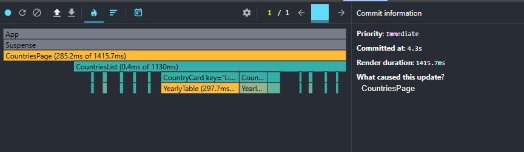
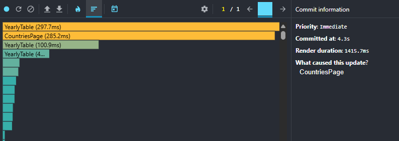
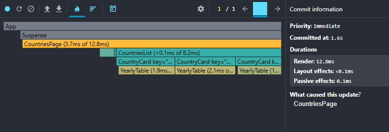
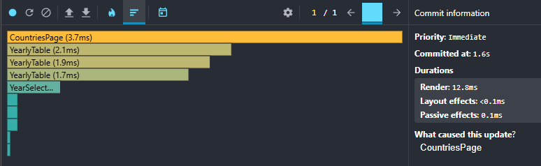
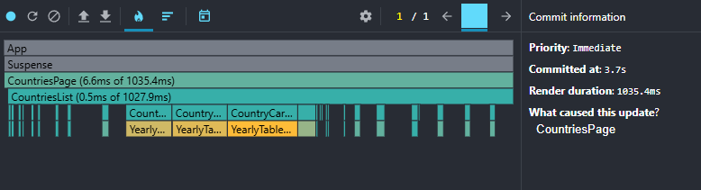
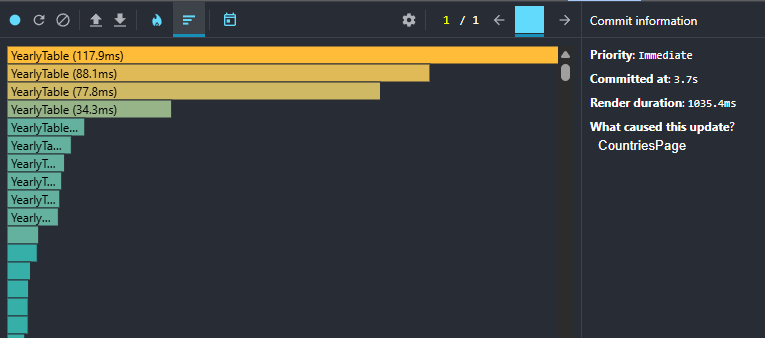
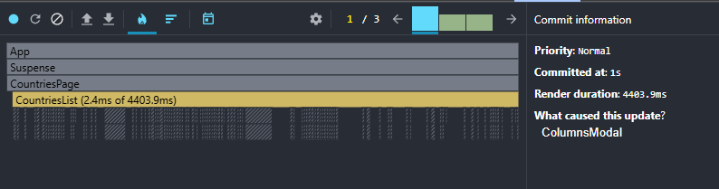
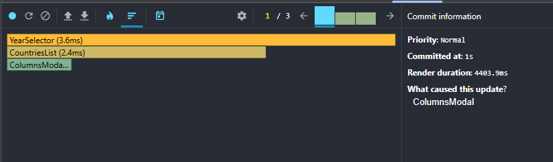

# React. Task #8 React Performance

## React Performance Profiling Report

## Baseline Performance (Before Optimizations)

### Test Environment
- Browser: Chrome/Firefox
- Dataset: ~240 countries, ~270 years of data per country
- Date: [Current Date]

### Test Scenarios

### 1. Sorting Performance
**Action:** Change sorting from "Name A-Z" to "Population descending"

**Metrics:**
- **Commit Duration:** 4.3s
- **Render Duration:** 1415.7ms  
- **Components Rendered:** ~240 components

**Interaction Details:**
- **Triggered by:** onChange (sort dropdown)
- **Total interaction time:** 4.3s
- **Root cause:** CountriesPage state change

**Ranked Chart (Top 3 slowest):**

1. YearlyTable: 297.7ms (multiple instances)
2. CountriesPage: 285.2ms  
3. CountryCard: ~50-100ms (multiple instances)

**Flame Graph:** [Screenshot attached]

**Analysis:** Every sort change triggers re-render of all country cards and data tables. YearlyTable components are the main performance bottleneck.

### 2. Search Performance  
**Action:** Search for "United"

**Metrics:**
- **Commit Duration:** 1.6s
- **Render Duration:** 12.8ms ✅ (vs 1415.7ms for sorting)
- **Components Rendered:** 3 countries found

**Interaction Details:**
- **Triggered by:** onChange (search input)
- **Total interaction time:** 1.6s
- **Root cause:** CountriesPage state change

**Ranked Chart (Top 4 slowest):**
1. CountriesPage: 3.7ms
2. YearlyTable: 2.1ms
3. YearlyTable: 1.9ms  
4. YearlyTable: 1.7ms

**Flame Graph:** [Both screenshots attached]

**Analysis:** Search is dramatically faster than sorting (12.8ms vs 1415.7ms render time) because filtering reduces the number of components. Only ~3 countries match "United", so only 3 YearlyTable components render instead of 240+.

**Key Finding:** Performance directly correlates with the number of YearlyTable instances rendered.

### 3. Year Change Performance

**Action:** Change year from 2020 to 2019

**Metrics:**
- **Commit Duration:** 3.7s
- **Render Duration:** 1835.4ms
- **Components Rendered:** All ~240 countries + tables

**Interaction Details:**
- **Triggered by:** onChange (year selector)
- **Total interaction time:** 3.7s
- **Root cause:** CountriesPage state change (year + re-sort + highlight)

**Ranked Chart (Top 5 slowest):**
1. YearlyTable: 117.9ms (single table instance!)
2. YearlyTable: 88.1ms
3. YearlyTable: 77.8ms
4. YearlyTable: 34.3ms
5. YearlyTable: [multiple instances]

**Flame Graph:** [Screenshots attached]

**Analysis:** Year change is the slowest operation because:
1. All countries remain rendered (no filtering)
2. Every YearlyTable re-renders for year highlighting
3. Population-based sorting recalculates for new year
4. Highlight animation adds additional overhead

**Critical Finding:** Individual YearlyTable components take 80-120ms each to render. With 240+ countries, this creates massive performance bottleneck.

#### 4. Column Selection Performance
**Action:** Add "methane" column via modal

**Metrics:**
- **Commit Duration:** 1s (single commit)
- **Render Duration:** 4403.9ms (WORST PERFORMANCE!)
- **Components Rendered:** All ~240 countries + all tables restructured

**Interaction Details:**
- **Triggered by:** ColumnsModal state change
- **Total interaction time:** 1s (per commit, multiple commits)
- **Root cause:** ColumnsModal → CountriesPage → all YearlyTables

**Ranked Chart (Top 3):**
1. YearSelector: 3.6ms
2. CountriesList: 2.4ms  
3. ColumnsModal: <1ms

**Flame Graph:** [Screenshots attached]

**Analysis:** Column changes trigger the worst performance because:
1. Every YearlyTable component restructures its columns
2. 240+ tables simultaneously add/remove DOM columns
3. No memoization - all tables re-render from scratch
4. Each table recalculates its entire column layout

**CRITICAL:** This scenario shows 4.4 seconds render time - completely unacceptable UX.

---

## Optimized Performance (After React.memo/useMemo)
[To be filled after optimization]
