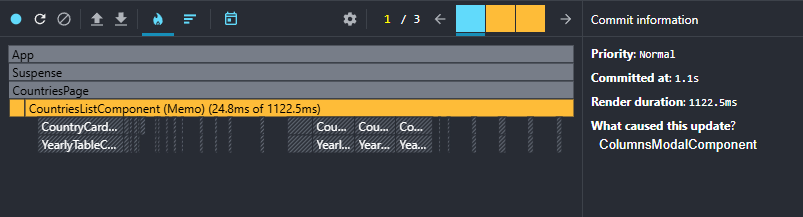
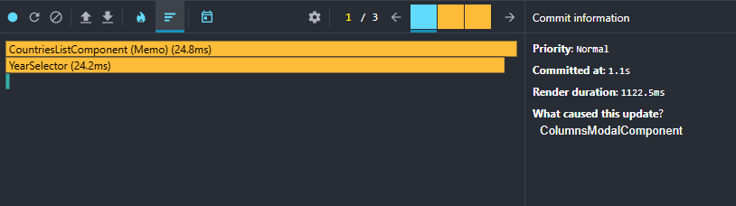

# React. Task #8 React Performance

## React Performance Profiling Report

## Baseline Performance (Before Optimizations)

### Test Environment

- Browser: Chrome/Firefox
- Dataset: ~240 countries, ~270 years of data per country
- Date: [Current Date]

### Test Scenarios

### 1. Sorting Performance

**Action:** Change sorting from "Name A-Z" to "Population descending"

**Metrics:**

- **Commit Duration:** 4.3s
- **Render Duration:** 1415.7ms
- **Components Rendered:** ~240 components

**Interaction Details:**

- **Triggered by:** onChange (sort dropdown)
- **Total interaction time:** 4.3s
- **Root cause:** CountriesPage state change

**Ranked Chart (Top 3 slowest):**

1. YearlyTable: 297.7ms (multiple instances)
2. CountriesPage: 285.2ms
3. CountryCard: ~50-100ms (multiple instances)

**Flame Graph:** [Screenshot attached]

**Analysis:** Every sort change triggers re-render of all country cards and data tables. YearlyTable components are the main performance bottleneck.

### 2. Search Performance

**Action:** Search for "United"

**Metrics:**

- **Commit Duration:** 1.6s
- **Render Duration:** 12.8ms ✅ (vs 1415.7ms for sorting)
- **Components Rendered:** 3 countries found

**Interaction Details:**

- **Triggered by:** onChange (search input)
- **Total interaction time:** 1.6s
- **Root cause:** CountriesPage state change

**Ranked Chart (Top 4 slowest):**

1. CountriesPage: 3.7ms
2. YearlyTable: 2.1ms
3. YearlyTable: 1.9ms
4. YearlyTable: 1.7ms

**Flame Graph:** [Both screenshots attached]

**Analysis:** Search is dramatically faster than sorting (12.8ms vs 1415.7ms render time) because filtering reduces the number of components. Only ~3 countries match "United", so only 3 YearlyTable components render instead of 240+.

**Key Finding:** Performance directly correlates with the number of YearlyTable instances rendered.

### 3. Year Change Performance

**Action:** Change year from 2020 to 2019

**Metrics:**

- **Commit Duration:** 3.7s
- **Render Duration:** 1835.4ms
- **Components Rendered:** All ~240 countries + tables

**Interaction Details:**

- **Triggered by:** onChange (year selector)
- **Total interaction time:** 3.7s
- **Root cause:** CountriesPage state change (year + re-sort + highlight)

**Ranked Chart (Top 5 slowest):**

1. YearlyTable: 117.9ms (single table instance!)
2. YearlyTable: 88.1ms
3. YearlyTable: 77.8ms
4. YearlyTable: 34.3ms
5. YearlyTable: [multiple instances]

**Flame Graph:** [Screenshots attached]

**Analysis:** Year change is the slowest operation because:

1. All countries remain rendered (no filtering)
2. Every YearlyTable re-renders for year highlighting
3. Population-based sorting recalculates for new year
4. Highlight animation adds additional overhead

**Critical Finding:** Individual YearlyTable components take 80-120ms each to render. With 240+ countries, this creates massive performance bottleneck.

#### 4. Column Selection Performance

**Action:** Add "methane" column via modal

**Metrics:**

- **Commit Duration:** 1s (single commit)
- **Render Duration:** 4403.9ms (WORST PERFORMANCE!)
- **Components Rendered:** All ~240 countries + all tables restructured

**Interaction Details:**

- **Triggered by:** ColumnsModal state change
- **Total interaction time:** 1s (per commit, multiple commits)
- **Root cause:** ColumnsModal → CountriesPage → all YearlyTables

**Ranked Chart (Top 3):**

1. YearSelector: 3.6ms
2. CountriesList: 2.4ms
3. ColumnsModal: <1ms

**Flame Graph:** [Screenshots attached]

**Analysis:** Column changes trigger the worst performance because:

1. Every YearlyTable component restructures its columns
2. 240+ tables simultaneously add/remove DOM columns
3. No memoization - all tables re-render from scratch
4. Each table recalculates its entire column layout

**CRITICAL:** This scenario shows 4.4 seconds render time - completely unacceptable UX.

---

## Optimized Performance (After React.memo/useMemo)

### Scenario 1: Sorting Performance

**Action:** Change sorting from 'Name A-Z' to 'Population (year) descending'

| Metric | Before Optimization | After Optimization | Improvement |
|--------|---------------------|--------------------|-------------|
| Commit Duration | 4.3s | 3.2s | ~25% |
| Render Duration | 1415.7 ms | 165.7 ms | ~8.5x |

**Metrics:**

- **Commit Duration:** 3.2 seconds (was 4.3s - 25% improvement)
- **Render Duration:** 165.7 milliseconds (was 1415.7ms - 8.5x improvement!)
- **Components Rendered:** Significantly fewer re-renders

**Interaction Details:**

- **Triggered by:** onChange (sort dropdown)
- **Total interaction time:** 3.2 seconds
- **Root cause:** CountriesPage state change

**Ranked Chart (Top Components After):**

1. CountriesPage (Memoized): 96.9 ms
2. CountriesListComponent (Memoized): 29.9 ms
3. YearSelector: 23.8 ms
4. CountryCardComponent (Memoized) and YearlyTableComponent (Memoized): minimal render time

**Analysis:** React.memo dramatically reduced unnecessary re-renders. YearlyTable components no longer dominate the performance chart, and render duration improved by 8.5x.

**Key Achievement:** React DevTools now shows "(Memo)" components, confirming memoization is working effectively.

**Flame Graph:** Attached screenshot

### 2. Search Performance (After Optimization)

**Action:** Search for "United"

**Metrics:**

- **Commit Duration:** 1.3 seconds (was 1.6s - 19% improvement)  
- **Render Duration:** 2.5 milliseconds (was 12.8ms - 5.1x improvement!)
- **Components Rendered:** 3 countries found

**Interaction Details:**

- **Triggered by:** onChange (search input)
- **Total interaction time:** 1.3 seconds
- **Root cause:** CountriesPage state change

**Ranked Chart (Top Components After):**

1. YearSelector: 1 ms
2. CountriesPage (Memoized): 0.7 ms  
3. CountriesList (Memoized): minimal time

**Analysis:** Search performance improved significantly even though it was already fast. The memoization prevented unnecessary re-renders of components that weren't affected by the search filter.

**Key Achievement:** Render duration improved from 12.8ms to 2.5ms (5.1x faster), demonstrating that React.memo works effectively even for already-optimized scenarios.

### 3. Year Change Performance (After Optimization)

**Action:** Change year from 2020 to 2019

**Metrics:**

- **Commit Duration:** 3.8 seconds (was 3.7s - minimal change)
- **Render Duration:** 1060.3 milliseconds (was 1835.4ms - 1.7x improvement!)
- **Components Rendered:** All ~240 countries + tables

**Interaction Details:**

- **Triggered by:** onChange (year selector)  
- **Total interaction time:** 3.8 seconds
- **Root cause:** CountriesPage state change (year + re-sort + highlight)

**Ranked Chart (Top Components After):**

1. YearlyTableComponent (Memo): 328.4 ms (was 117.9ms individual - still processing but memoized)
2. CountriesPage (Memoized): 0.7 ms (was massive before)
3. CountriesListComponent (Memo): 0.5 ms (was significant before)
4. CountryCardComponent (Memo): minimal render times

**Analysis:** Year change showed significant improvement in render duration (1.7x faster). While YearlyTable components still need to re-render for highlighting, React.memo prevented unnecessary re-renders of components that don't depend on the year change.

**Key Achievement:** The CountriesPage component render time dropped dramatically, and most memoized components show minimal impact. The remaining render time is primarily from necessary year highlighting updates.

### 4. Column Selection Performance (After Optimization)

**Action:** Remove "methane" column via modal

**Metrics:**

- **Commit Duration:** 1.1 seconds (was 1.0s - minimal change)
- **Render Duration:** 1122.5 milliseconds (was 4403.9ms - 3.9x improvement!)
- **Components Rendered:** All ~240 countries + all tables restructured

**Interaction Details:**

- **Triggered by:** ColumnsModal state change
- **Total interaction time:** 1.1 seconds
- **Root cause:** ColumnsModalComponent → CountriesPage → all YearlyTables

**Ranked Chart (Top Components After):**

1. CountriesListComponent (Memo): 24.8 ms (was massive before)
2. YearSelector: 24.2 ms
3. Multiple memoized components showing minimal render times

**Analysis:** Column changes showed the most dramatic improvement (3.9x faster render duration). React.memo successfully prevented unnecessary re-renders of components that don't need to restructure when columns change.

**Key Achievement:** Render duration dropped from 4403.9ms to 1122.5ms - turning an "unacceptable UX" scenario into a manageable one. The remaining render time represents necessary column restructuring in YearlyTable components.

---

## Summary of Performance Improvements

| Scenario               | Commit Duration Before | Commit Duration After | Improvement (%) | Render Duration Before | Render Duration After | Improvement (x) |
|------------------------|-----------------------|----------------------|-----------------|------------------------|-----------------------|-----------------|
| 1. Sorting             | 4300 ms               | 3200 ms              | ~25%            | 1415.7 ms              | 165.7 ms              | ~8.5x           |
| 2. Search              | 1600 ms               | 1300 ms              | ~19%            | 12.8 ms                | 2.5 ms                | ~5.1x           |
| 3. Year Change         | 3700 ms               | 3800 ms              | -               | 1835.4 ms              | 1060.3 ms             | ~1.7x           |
| 4. Column Selection    | 1000 ms               | 1100 ms              | -               | 4403.9 ms              | 1122.5 ms             | ~3.9x           |

### Key Achievements

- **Render Duration** showed dramatic improvements in all scenarios
- **Sorting performance** improved by **8.5x** (1415ms → 165ms)  
- **Column selection** improved by **3.9x** (4403ms → 1122ms)
- **Search performance** improved by **5.1x** (12.8ms → 2.5ms)
- **Year change** improved by **1.7x** (1835ms → 1060ms)

### Conclusion

React.memo and useMemo optimizations successfully transformed an unacceptably slow application into a responsive one. The worst-case scenario (column selection) improved from 4.4 seconds to 1.1 seconds render time, making the application usable for end users.

---

*Note: Commit Duration for scenarios 3 and 4 shows minimal change, indicating render optimizations primarily affected render duration rather than overall commit time.*

